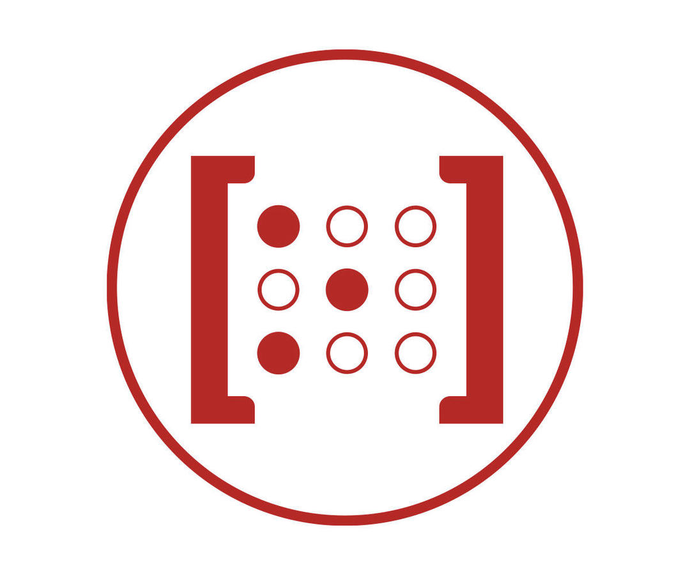
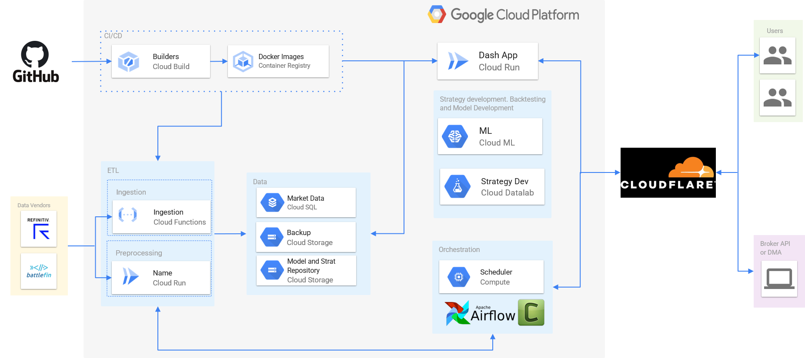

    
     
     
    <b>Quant Trading Cloud Infrastructure</b>
     
     

---

MBATS ([V1.0](https://github.com/saeed349/Microservices-Based-Algorithmic-Trading-System) & [V2.0](https://github.com/saeed349/Microservices-Based-Algorithmic-Trading-System-V-2.0)) is a docker based platform for developing, testing and deploying Algorthmic Trading strategies with a focus on Machine Learning based algorithms.

This repository is an advanced version of the MBATS infrastructure that you can use to provision Google Cloud and CloudFlare services so that you could take the different components of MBATS into the cloud.
 
In this repository you can find the Terraform code for provisioning the following Google Cloud Services
* [Cloud Run](https://cloud.google.com/run) : Deploy containerized applications on a fully managed serverless platform.
* [Cloud SQL](https://cloud.google.com/sql) : Fully managed PostgreSQL Server.
* [Cloud Storage](https://cloud.google.com/storage) : Scalable Object storage 
* [Cloud Function](https://cloud.google.com/functions) : Scalable pay-as-you-go functions as a service (FaaS). 
* [Compute Engine](https://cloud.google.com/compute) : Compute service to create and run virtual machines.
* [Cloud build](https://cloud.google.com/build) : Serverless CI/CD platform.
* [CloudFlare](https://www.cloudflare.com/) : Enhanced security and protection for Webapplication. 

Using the above set of services you could transfer each services in [MBATS V2.0](https://github.com/saeed349/Microservices-Based-Algorithmic-Trading-System-V-2.0) to Google Cloud using [Terraform](https://www.terraform.io/). 

I will leave out the step-by process of combining all the different services together in this repository as each of the subfolders in the repository has all the terraform code and supporting documentation and they are grouped in a way that they are fairly independent from one another. Rather I will focus on what containers in MBATS are hosted in these cloud services and the reasoning behind it.

The provisioning Terraform code has been designed in such a way that it not only creates different cloud services but also manages loading the application logic into these services, this way the the local application/code (in the docker compose) gets implemented seamlessly in the cloud. And the way we are doing that is by utlizing [Cloud build](https://cloud.google.com/build) wherever possible. This way, we can develop the code localy in the [MBATS](https://github.com/saeed349/Microservices-Based-Algorithmic-Trading-System-V-2.0) environment (docker compose) and then push the changes to the online-repository(github for example) and then the [Cloud build](https://cloud.google.com/build) will autoamtically update the cloud service.

* [Cloud Run](https://cloud.google.com/run) : Plotly Dash is hosted in the Cloud Run services as scalable Web-application. Using [build](https://cloud.google.com/build) we creates an image in [Container Registry](https://cloud.google.com/container-registry) with every commit and this gets pushed to the Cloud Run service. You can access the web-application via a private link or you can open it up to the world via a domain. I have done the latter and the the DNS routing and the firewall rules are setup through CloudFlare via Terraform. The analagous service in AWS to Cloud Run is [Fargate](https://aws.amazon.com/fargate)
* [Cloud SQL](https://cloud.google.com/sql) : All the Security Master, Position Analytics, Risk Analytics data are stored here. Since its Postgres, making the switch from Local to Cloud SQL is seamless, you just have to change the end-point. Additionaly I have included Terraform code for creating backups of the Server instance when its deleted. 
* [Cloud Storage](https://cloud.google.com/storage) : Minio is replaced with Cloud Storage. And since we are using [Boto3](https://boto3.amazonaws.com/v1/documentation/api/latest/index.html) in all the codebase in MBATS, making the switch here from Local to cloud is also seamless. The analagous service in AWS is [S3](https://aws.amazon.com/s3/).
* [Cloud Function](https://cloud.google.com/functions) : Cloud Functions can be utilized multiple ways in this project. The primary way I have used is to fetch the data from the Data Vendors rest API and store it to the Cloud SQL. Flask is the underlying framework used to handle incoming HTTP requests. So you could trigger these either by [Cloud Scheduler](https://cloud.google.com/scheduler) or via Airflow. The analagous service in AWS is [Lambda](https://aws.amazon.com/lambda/)
* [Compute Engine](https://cloud.google.com/compute) : Apache Airflow, Celery workers and Flower are hosted in docker compose in the Compute Engine. The end-points are controlled by a reverse-proxy (Nginx) container and they are exposed to domain via CloudFlare. The live strategy needs to be run on a machine that doesn't have a timeout and that's the reason we haven't used Cloud Run (max timeout:15 minutes) or Cloud Function (max timeout:9 minutes) for this particular case. The analagous service in AWS is [EC2](https://aws.amazon.com/ec2/).

Now if you notice all the different services, the only service that's not truly serverless is the Compute Engine. The reason why this is the case is because the hosted Airflow services in Google Cloud is [Cloud Composer](https://cloud.google.com/composer), this uses Kubernettes as backend and with my current workload and use-case I felt that it was an overkill. On-top of that sometimes serverless technologies can be cost prohibitve as well, so its combination of simplicity and cost that made me to go with [Compute Engine](https://cloud.google.com/compute).

[Latest Linkedin Article on scaling MBATS to the cloud using Terraform](https://www.linkedin.com/post/edit/6619730514188267520/)  
[Linkedin Article about MBATS](https://www.linkedin.com/post/edit/6619730514188267520/)

# Architecture

# General Requisites
## Terraform project Setup
### Linux
- Unpack the .tar.gz file
- Make sure you have terraform **v0.12.17** or newer installed
- Edit the `env.tfvars` file as required

### Windows
- Unpack the .zip file
- Make sure you have terraform **v0.12.17** or newer installed
- Edit the `env.tfvars` file as required

## GCP Credentials for Terraform
Terraform needs permissions to create and modify all Cloud Run, Cloud Build and Container Registry-related resources. The easiest way
to do this is to create a service account with project owner permissions.

**Note**: KEEP THE CREDENTIALS FILE SECURE. Access to it could compromise all your Google Cloud account. There is a `.gitignore` file
supplied with this that'll prevent commiting files named `credentials.json` to prevent accidental submitting this to a git repository.

To create the credentials file:

1. Open your [GCP Service Account](https://console.cloud.google.com/iam-admin/serviceaccounts) page
2. Click on _"Create service account"_
3. Fill in a name (such as terraform) and a description for the account and click _"create"_
4. Choose _"Project -> Owner"_ and click _"Continue"_
5. Click on _"Create Key"_, choose _"JSON"_ and click on _"Create"_. Move the downloaded file to the terraform directory and rename it to `credentials.json`  
If you're on Windows you also need to place a copy of this file in the `bootstrap` directory.
6. Click _"Done"_

## Install gcloud
You need the [gcloud sdk](https://cloud.google.com/sdk) installed and set up with your account in order for the database backup and restore operations to work.

To install it, follow the instructions on https://cloud.google.com/sdk/docs/downloads-interactive

After installing:
- Open a command line terminal
- Type `gcloud auth login`
- Follow the instructions and complete the login procedure
- Type `gcloud config set project PROJECT_ID`, replacing *PROJECT_NAME* for your actual GCP project ID

## Install terraform 0.12
The terraform templates were tested on terraform _v0.12.17_, _v0.12.18_, _v0.12.19_ and _v0.12.20_ (the latest at the time of the template creation). Please make
sure you're using a recent version of the **0.12 family**. **The templates will NOT work on terraform 0.11**.

Install Terraform by downloading it from the [official website](https://www.terraform.io/downloads.html), unzipping it and moving it to a directory included in your system's PATH .

Family upgrades (i.e: to an eventual _0.13_) may require rewrite and/or tweaking of the templates.

**Note** When using terraform `v0.12.18` or newer, you'll receive a deprecation warning. As of terraform `v0.12.20` this can be safely ignored.

## Set up Cloud Build service account as a Cloud Functions Developer
Grant the Cloud Functions Admin role to the Cloud Build service account. This needs to be done only once in a new GCP project:

1. In Cloud Console, go to the project [IAM settings](https://console.cloud.google.com/iam-admin/iam)
2. Locate the Cloud Build account. It will be named like `project_id@cloudbuild.gserviceaccount.com`
3. Click the edit (pencil) button
4. On the side panel, click on *ADD ANOTHER ROLE*
5. Click on *Select a role*
6. Type `cloud functions admin` on the *Type to filter* box
7. Click on the filter result
8. Click on *SAVE*

## Connect GCP to GitHub
Before creating the trigger the Cloud Function source repositories *MUST* be connected
to your GCP project.

Follow the steps below to properly set up your GCP connecting with GitHub.

### Connecting GCP to GitHub
1. Open your [GCP panel](https://console.cloud.google.com)
2. Search for _"Cloud Build"_
3. Click on _"Triggers"_
4. Click on _"Connect Repository"_
5. Choose _"GitHub (Cloud Build GitHub App)"_
6. Follow the authentication steps on the screen. 
7. Click on _"Install Google Cloud Build"_. You can then install it on all repositories or only on the project you want to build on GCP. 
8. Choose the project by clicking on the checkbox besides it, the checkbox saying that you understand Google's terms and then clicking on "Connect Repository". **Make sure to select all the projects related to the Cloud Functions you want to deploy.**

**Skip the "Create a Push Triger" step.**

# Other notes
## Destroying environments
When destroying environments the Google Cloud Storage buckets will not be removed and you'll receive an error about that. **This is expected** and is done to prevent accidental data loss on the buckets.

Data that might be essential are the state files in the functions bucket and the database backups on the backups bucket. In order to remove the buckets please delete all files manually from them. You can access your buckets on the [GCP console](https://console.cloud.google.com/storage/browser).

If you really want to remove the buckets automatically you can add the `force_destroy = true` parameters to the buckets on the `buckets.tf` file and apply the environment settings. Please note that deleting the buckets is an irreversible operation, so use this with care.

## Removing Cloud Functions
No triggers are provided to remove created cloud functions. In order to do so please remove them on the [GCP console](https://console.cloud.google.com/functions). After doing that should also remove the related state files from the cloud functions bucket.

     
# Built With
This project has been devloped and tested on 2 Docker environments
* [Terraform](https://www.terraform.io/)
* [WSL](https://docs.microsoft.com/en-us/windows/wsl/about)
* [Docker Toolbox](https://docs.docker.com/toolbox/toolbox_install_windows/). 
* IDE - Visual Studio Code: Main reason being the [Container Debugger Feature](https://code.visualstudio.com/docs/remote/containers#_debugging-in-a-container) 

# Contributing

All code contributions must go through a pull request and approved by a core developer before being merged. This is to ensure proper review of all the code.

# License

This repository is available under the [BSD 3-Clause License](./LICENSE).

# Authors

* **Saeed Rahman** - [LinkedIn](https://www.linkedin.com/in/saeed-349/)
